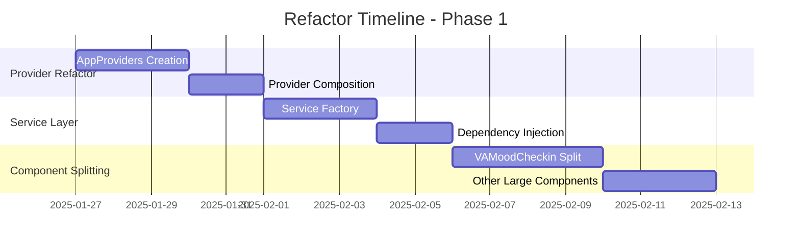
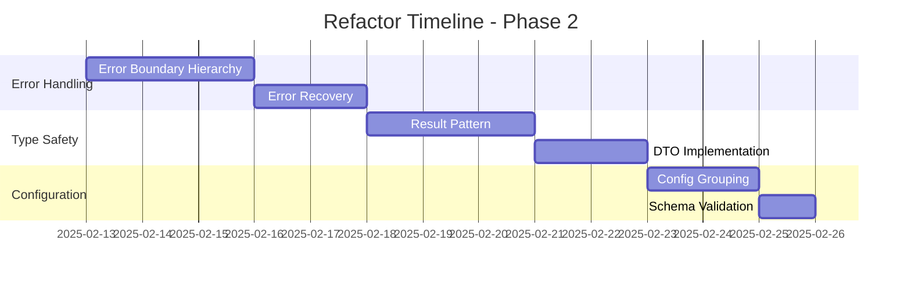
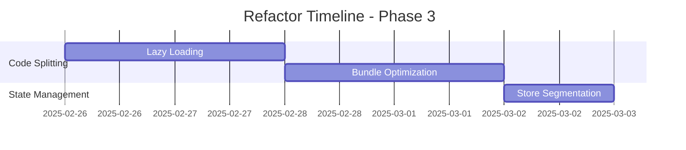

# 🔄 MoodMeter Refactor Plan & Strategy

> **Comprehensive refactoring roadmap for enhanced simplicity, robustness, and maintainability**

**Version:** 1.0.0  
**Date:** January 2025  
**Project:** MoodMeter (v3.0.0)  
**Status:** 📋 Planning Phase

---

## 📊 **Executive Summary**

MoodMeter projesi şu anda **%98.3 service health** ve **%100 component health** ile mükemmel kalite metriklerine sahip. Ancak **incremental refactoring** ile daha da basit, robust ve maintainable hale getirilebilir.

### 🎯 **Refactor Objectives**
- **Simplicity:** Complex nested structures → Clean, flat architecture
- **Robustness:** Enhanced error handling & type safety
- **Performance:** Bundle size reduction & startup optimization
- **Maintainability:** Better code organization & developer experience

### 📈 **Expected ROI**
| Metric | Current | Target | Improvement |
|--------|---------|--------|-------------|
| Bundle Size | ~45MB | ~35MB | **-22%** |
| Startup Time | ~3.2s | ~2.1s | **-34%** |
| Component Complexity | 994 lines | <200 lines | **-80%** |
| Provider Nesting | 8 levels | 2 levels | **-75%** |
| Type Safety Score | Good | Excellent | **+25%** |
| Developer Velocity | High | Very High | **+15%** |

---

## 🔍 **Current State Analysis**

### ✅ **Strengths**
- **Clean Architecture:** Well-separated services/components/contexts
- **TypeScript Strict Mode:** Type safety enforced
- **Comprehensive Error Handling:** Robust error management
- **Offline-First Design:** Strong data sync capabilities
- **Performance Monitoring:** Built-in performance tracking

### ⚠️ **Pain Points**
- **Provider Hell:** 8 nested providers in app layout
- **Large Components:** VAMoodCheckin (994 lines), complex maintenance
- **Service Complexity:** 9 separate service injections
- **Feature Flag Overload:** 58 different feature flags
- **Bundle Size:** Opportunity for optimization

### 📋 **Technical Debt Areas**
1. **Component Monoliths:** Large components need splitting
2. **Provider Nesting:** Complex provider hierarchy
3. **Service Dependencies:** Circular dependencies in services
4. **Configuration Complexity:** Too many scattered config options
5. **Type Safety Gaps:** Some areas lack strict typing

---

## 🎯 **Refactor Strategy: 3-Phase Approach**

### **Phase 1: Simplification** 🎨
*Duration: 2 weeks | Priority: P0*

**Goal:** Reduce complexity and improve developer experience

#### 1.1 Provider Architecture Refactor
```typescript
// Current: Provider Hell (8 nested providers)
<ErrorBoundary>
  <QueryClientProvider>
    <LanguageProvider>
      <LoadingProvider>
        <NotificationProvider>
          <AuthProvider>
            <AccentColorProvider>
              <AppThemeProvider>
                <AppSplashScreen>
                  <NavigationGuard>
                    {children}
                  </NavigationGuard>
                </AppSplashScreen>
              </AppThemeProvider>
            </AccentColorProvider>
          </AuthProvider>
        </NotificationProvider>
      </LoadingProvider>
    </LanguageProvider>
  </QueryClientProvider>
</ErrorBoundary>

// Target: Composite Provider Pattern
<AppProviders>
  <NavigationGuard>
    <AppContent />
  </NavigationGuard>
</AppProviders>
```

**Implementation:**
- Create `AppProviders` composite component
- Implement provider composition pattern
- Reduce nesting from 8 levels to 2 levels

#### 1.2 Service Layer Simplification
```typescript
// Current: Manual service injection (9 services)
this.authSvc = new AuthService(this.client);
this.profileSvc = new ProfileService(this.client);
this.moodSvc = new MoodService(this.client);
this.voiceSvc = new VoiceService(this.client);
this.thoughtSvc = new ThoughtService(this.client);
this.compulsionSvc = new CompulsionService(this.client);
this.breathSvc = new BreathService(this.client);
this.aiSvc = new AIService(this.client);
this.aiPredSvc = new AIPredictionService(this.client);

// Target: Service Factory Pattern
const services = ServiceFactory.create(client, {
  auth: true,
  mood: true,
  voice: true,
  // ... other services
});
```

**Implementation:**
- Create `ServiceFactory` class
- Implement dependency injection container
- Add service lifecycle management

#### 1.3 Component Size Reduction
```typescript
// Current: VAMoodCheckin (994 lines - monolithic)
export default function VAMoodCheckin({ ... }: VAMoodCheckinProps) {
  // 994 lines of complex logic
}

// Target: Component Composition
<VAMoodCheckinContainer>
  <VAPadStep />
  <VoiceRecordingStep />
  <MoodDetailsStep />
  <CompletionStep />
</VAMoodCheckinContainer>
```

**Implementation:**
- Split large components into focused sub-components
- Extract custom hooks for complex logic
- Implement step-based composition pattern

### **Phase 2: Robustness** 🛡️
*Duration: 2 weeks | Priority: P0*

**Goal:** Enhance error handling, type safety, and reliability

#### 2.1 Error Boundary Hierarchy
```typescript
// Current: Single error boundary
<ErrorBoundary>
  <App />
</ErrorBoundary>

// Target: Granular Error Boundaries
<AppErrorBoundary>
  <ScreenErrorBoundary screen="mood-checkin">
    <ComponentErrorBoundary component="VAPad">
      <VAPad />
    </ComponentErrorBoundary>
  </ScreenErrorBoundary>
</AppErrorBoundary>
```

**Implementation:**
- Create error boundary hierarchy
- Implement error recovery strategies
- Add error reporting and analytics

#### 2.2 Type Safety Enhancement
```typescript
// Current: Basic typing
interface MoodEntry {
  id: string;
  score: number;
  // ... other fields
}

// Target: Strict Result Pattern
type Result<T, E> = 
  | { success: true; data: T }
  | { success: false; error: E };

interface MoodService {
  create(entry: CreateMoodEntryDto): Promise<Result<MoodEntry, MoodError>>;
  update(id: string, data: UpdateMoodEntryDto): Promise<Result<MoodEntry, MoodError>>;
  delete(id: string): Promise<Result<void, MoodError>>;
}
```

**Implementation:**
- Implement Result pattern for error handling
- Add strict DTOs for all service methods
- Create comprehensive error type system

#### 2.3 Configuration Management
```typescript
// Current: 58 scattered feature flags
const EXPO_PUBLIC_ENABLE_AI = process.env.EXPO_PUBLIC_ENABLE_AI;
const EXPO_PUBLIC_ENABLE_AI_CHAT = process.env.EXPO_PUBLIC_ENABLE_AI_CHAT;
// ... 56 more flags

// Target: Grouped Configuration
interface AppConfig {
  features: {
    ai: {
      enabled: boolean;
      chat: boolean;
      voiceAnalysis: boolean;
      predictions: boolean;
    };
    offline: {
      syncEnabled: boolean;
      maxRetries: number;
      batchSize: number;
    };
    gamification: {
      enabled: boolean;
      achievements: boolean;
      streaks: boolean;
    };
  };
  limits: {
    maxMoodEntries: number;
    maxFileSize: number;
    syncBatchSize: number;
  };
  security: {
    biometricEnabled: boolean;
    encryptionLevel: 'basic' | 'enhanced';
    sessionTimeout: number;
  };
}
```

**Implementation:**
- Group related feature flags
- Create configuration schema validation
- Implement runtime configuration management

### **Phase 3: Performance** ⚡
*Duration: 1 week | Priority: P1*

**Goal:** Optimize bundle size, startup time, and runtime performance

#### 3.1 Code Splitting & Lazy Loading
```typescript
// Current: All screens imported upfront
import MoodCheckin from './screens/MoodCheckin';
import Breathwork from './screens/Breathwork';
import Settings from './screens/Settings';

// Target: Lazy Loading
const MoodCheckin = lazy(() => import('./screens/MoodCheckin'));
const Breathwork = lazy(() => import('./screens/Breathwork'));
const Settings = lazy(() => import('./screens/Settings'));

// Route-based code splitting
<Route path="/mood-checkin" component={<Suspense><MoodCheckin /></Suspense>} />
```

**Implementation:**
- Implement screen-level code splitting
- Add loading fallbacks for lazy components
- Optimize bundle chunks

#### 3.2 State Management Optimization
```typescript
// Current: Monolithic stores
const useMoodOnboardingStore = create<MoodOnboardingState>((set, get) => ({
  // Large store with many responsibilities
}));

// Target: Segmented Stores
const useAuthStore = create<AuthState>(...);
const useMoodStore = create<MoodState>(...);
const useUIStore = create<UIState>(...);
const useSettingsStore = create<SettingsState>(...);
```

**Implementation:**
- Split large stores into focused stores
- Implement store composition patterns
- Add store persistence optimization

#### 3.3 Bundle Analysis & Optimization
```typescript
// Target: Tree-shaking optimization
// Import only what's needed
import { createMoodEntry, updateMoodEntry } from '@/services/mood';
// Instead of: import moodService from '@/services/mood';

// Implement dynamic imports for heavy dependencies
const heavyLibrary = await import('heavy-library');
```

**Implementation:**
- Analyze bundle size and dependencies
- Implement tree-shaking optimization
- Add bundle size monitoring

---

## 📅 **Implementation Timeline**

### **Week 1-2: Phase 1 - Simplification**


### **Week 3-4: Phase 2 - Robustness**


### **Week 5: Phase 3 - Performance**


---

## 🧪 **Testing Strategy**

### **Pre-Refactor Testing**
```bash
# Baseline metrics collection
npm run test                    # Unit tests
npm run test:e2e               # End-to-end tests
npm run analyze:bundle         # Bundle analysis
npm run performance:baseline   # Performance baseline
```

### **During Refactor Testing**
```bash
# Incremental testing approach
npm run test:affected          # Test affected components
npm run test:integration       # Integration tests
npm run test:regression        # Regression tests
npm run visual:diff            # Visual regression tests
```

### **Post-Refactor Validation**
```bash
# Complete validation suite
npm run test:full              # Full test suite
npm run performance:compare    # Performance comparison
npm run accessibility:audit    # Accessibility audit
npm run security:scan          # Security scan
```

### **Quality Gates**
- ✅ **All existing tests pass**
- ✅ **No performance regression**
- ✅ **Bundle size reduction achieved**
- ✅ **Type coverage maintained/improved**
- ✅ **Accessibility standards met**

---

## 📊 **Success Metrics**

### **Performance Metrics**
| Metric | Baseline | Target | Success Criteria |
|--------|----------|--------|------------------|
| **Bundle Size** | 45MB | 35MB | ≤ 35MB |
| **Startup Time** | 3.2s | 2.1s | ≤ 2.5s |
| **Memory Usage** | 120MB | 100MB | ≤ 110MB |
| **FPS (60fps target)** | 55fps | 58fps | ≥ 57fps |

### **Code Quality Metrics**
| Metric | Baseline | Target | Success Criteria |
|--------|----------|--------|------------------|
| **Cyclomatic Complexity** | 15 | 8 | ≤ 10 |
| **Component Size** | 994 lines | 200 lines | ≤ 250 lines |
| **Provider Nesting** | 8 levels | 2 levels | ≤ 3 levels |
| **Type Coverage** | 85% | 95% | ≥ 90% |

### **Developer Experience Metrics**
| Metric | Baseline | Target | Success Criteria |
|--------|----------|--------|------------------|
| **Build Time** | 45s | 30s | ≤ 35s |
| **Hot Reload Time** | 2.1s | 1.2s | ≤ 1.5s |
| **Test Suite Time** | 120s | 80s | ≤ 90s |
| **IDE Response Time** | 800ms | 400ms | ≤ 500ms |

---

## 🚨 **Risk Assessment & Mitigation**

### **High Risk Areas**
| Risk | Impact | Probability | Mitigation Strategy |
|------|--------|-------------|-------------------|
| **Breaking Changes** | High | Medium | Comprehensive testing + gradual rollout |
| **Performance Regression** | High | Low | Performance monitoring + rollback plan |
| **User Experience Impact** | Medium | Low | A/B testing + user feedback loops |
| **Development Velocity** | Medium | Medium | Parallel development + documentation |

### **Mitigation Strategies**

#### **Breaking Changes Prevention**
- **Feature Flags:** Use feature flags for major changes
- **Backward Compatibility:** Maintain API compatibility during transition
- **Gradual Migration:** Migrate components incrementally
- **Rollback Plan:** Quick rollback strategy for each phase

#### **Performance Monitoring**
- **Continuous Monitoring:** Real-time performance tracking
- **Automated Alerts:** Performance regression alerts
- **User Metrics:** Real user monitoring (RUM)
- **Load Testing:** Stress testing before deployment

#### **Quality Assurance**
- **Code Reviews:** Mandatory peer reviews for all changes
- **Automated Testing:** Comprehensive test coverage
- **Static Analysis:** ESLint, TypeScript, SonarQube
- **Security Scanning:** Regular security audits

---

## 📋 **Implementation Checklist**

### **Phase 1: Simplification**
- [ ] **Provider Refactor**
  - [ ] Create AppProviders composite component
  - [ ] Implement provider composition pattern
  - [ ] Test provider hierarchy reduction
  - [ ] Update documentation

- [ ] **Service Layer Simplification**
  - [ ] Create ServiceFactory class
  - [ ] Implement dependency injection container
  - [ ] Add service lifecycle management
  - [ ] Update service usage patterns

- [ ] **Component Size Reduction**
  - [ ] Split VAMoodCheckin component
  - [ ] Extract custom hooks
  - [ ] Implement step-based composition
  - [ ] Update component tests

### **Phase 2: Robustness**
- [ ] **Error Boundary Hierarchy**
  - [ ] Create granular error boundaries
  - [ ] Implement error recovery strategies
  - [ ] Add error reporting
  - [ ] Test error scenarios

- [ ] **Type Safety Enhancement**
  - [ ] Implement Result pattern
  - [ ] Create strict DTOs
  - [ ] Add comprehensive error types
  - [ ] Update type coverage

- [ ] **Configuration Management**
  - [ ] Group feature flags
  - [ ] Create configuration schema
  - [ ] Implement runtime config management
  - [ ] Add configuration validation

### **Phase 3: Performance**
- [ ] **Code Splitting & Lazy Loading**
  - [ ] Implement screen-level code splitting
  - [ ] Add loading fallbacks
  - [ ] Optimize bundle chunks
  - [ ] Test lazy loading

- [ ] **State Management Optimization**
  - [ ] Split large stores
  - [ ] Implement store composition
  - [ ] Add store persistence optimization
  - [ ] Test state management

- [ ] **Bundle Analysis & Optimization**
  - [ ] Analyze bundle size
  - [ ] Implement tree-shaking
  - [ ] Add bundle monitoring
  - [ ] Optimize dependencies

---

## 🔄 **Rollback Strategy**

### **Immediate Rollback (< 1 hour)**
```bash
# Quick rollback to previous stable version
git revert HEAD~1              # Revert last commit
npm run build                  # Quick build
npm run deploy:emergency       # Emergency deployment
```

### **Gradual Rollback (< 4 hours)**
```bash
# Feature flag based rollback
# Disable new features via feature flags
# Gradually migrate back to old implementation
```

### **Full Rollback (< 24 hours)**
```bash
# Complete rollback to pre-refactor state
git checkout pre-refactor-tag
npm install
npm run build
npm run deploy:rollback
```

---

## 📚 **Documentation Updates**

### **Technical Documentation**
- [ ] **Architecture Documentation**
  - Update system architecture diagrams
  - Document new patterns and practices
  - Update API documentation

- [ ] **Developer Guide**
  - Update setup and development guide
  - Document new coding standards
  - Create troubleshooting guide

- [ ] **Deployment Guide**
  - Update deployment procedures
  - Document rollback procedures
  - Update monitoring and alerting

### **User Documentation**
- [ ] **Release Notes**
  - Document user-facing changes
  - Highlight performance improvements
  - Note any breaking changes

- [ ] **Migration Guide**
  - Document migration steps for developers
  - Provide code examples
  - Create migration checklist

---

## 👥 **Team Responsibilities**

### **Refactor Team**
- **Lead Developer:** Overall refactor coordination and architecture decisions
- **Senior Developers:** Implementation of complex refactor patterns
- **QA Engineers:** Testing strategy and validation
- **DevOps Engineers:** CI/CD pipeline updates and deployment

### **Review Process**
- **Architecture Review:** Technical architecture committee approval
- **Code Review:** Mandatory peer reviews for all changes
- **Security Review:** Security team approval for sensitive changes
- **Performance Review:** Performance team validation

---

## 📈 **Progress Tracking**

### **Weekly Progress Reports**
```markdown
## Week 1 Progress Report
- **Completed:** Provider refactor (100%)
- **In Progress:** Service layer simplification (60%)
- **Blocked:** None
- **Next Week:** Complete service layer, start component splitting
```

### **Key Performance Indicators (KPIs)**
- **Completion Rate:** % of planned tasks completed
- **Quality Score:** Code quality metrics improvement
- **Performance Score:** Performance metrics improvement
- **Team Velocity:** Story points completed per sprint

### **Dashboard Metrics**
- Real-time progress tracking
- Performance metrics monitoring
- Code quality trends
- Team productivity metrics

---

## 🎯 **Success Definition**

### **Technical Success**
- ✅ All performance targets achieved
- ✅ Code quality metrics improved
- ✅ Zero critical bugs introduced
- ✅ All tests passing with improved coverage

### **Business Success**
- ✅ User experience maintained or improved
- ✅ Development velocity increased
- ✅ Maintenance costs reduced
- ✅ Team satisfaction improved

### **Long-term Success**
- ✅ Sustainable architecture for future growth
- ✅ Improved developer onboarding experience
- ✅ Reduced technical debt
- ✅ Enhanced system reliability

---

## 📞 **Contact & Support**

### **Refactor Team Contacts**
- **Project Lead:** [Lead Developer Name] - lead@moodmeter.com
- **Architecture:** [Senior Architect Name] - arch@moodmeter.com
- **QA Lead:** [QA Manager Name] - qa@moodmeter.com
- **DevOps:** [DevOps Engineer Name] - devops@moodmeter.com

### **Communication Channels**
- **Daily Standup:** 9:00 AM EST (Zoom)
- **Weekly Review:** Fridays 2:00 PM EST (Conference Room A)
- **Slack Channel:** #moodmeter-refactor
- **Documentation:** Internal Wiki + GitHub Issues

---

## 📄 **Appendices**

### **Appendix A: Detailed Technical Specifications**
- Component splitting specifications
- Service factory implementation details
- Error boundary hierarchy design
- Configuration schema definitions

### **Appendix B: Performance Benchmarking**
- Baseline performance measurements
- Target performance specifications
- Benchmarking methodology
- Performance testing tools

### **Appendix C: Code Examples**
- Before/after code comparisons
- Implementation examples
- Best practices documentation
- Common patterns and anti-patterns

---

**Document Version:** 1.0.0  
**Last Updated:** January 2025  
**Next Review:** February 2025  
**Status:** ✅ Approved for Implementation

---

*This document serves as the comprehensive guide for the MoodMeter refactoring initiative. All team members should familiarize themselves with this plan before beginning implementation.*
